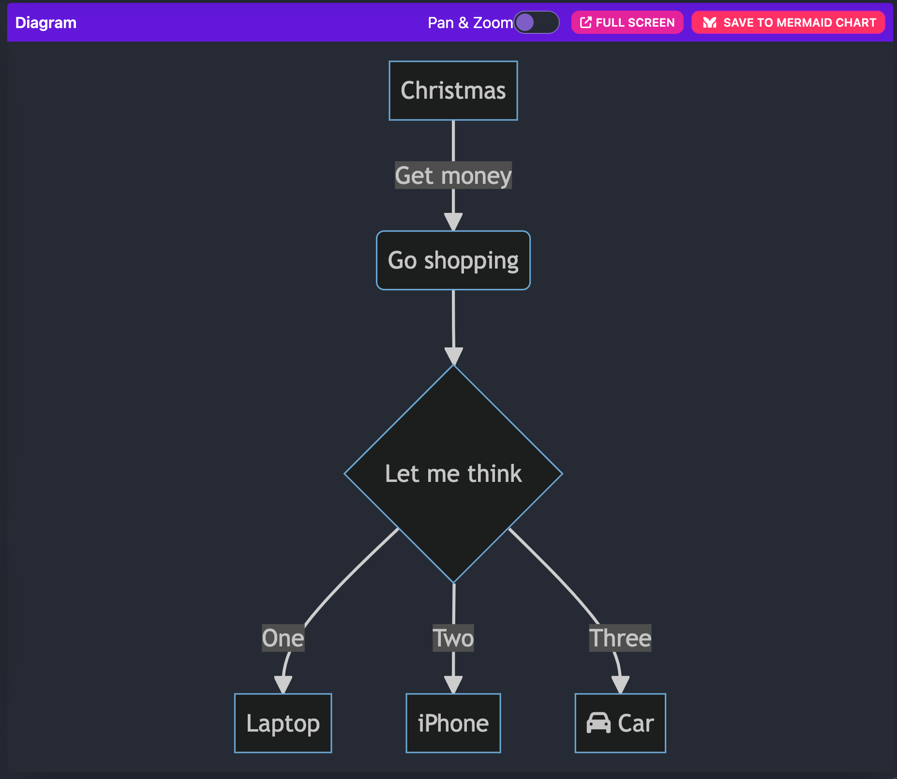

# Mermaid

Mermaid is a JavaScript-based diagramming and charting tool that uses 
Markdown-inspired text definitions and a renderer to create and modify complex diagrams. 
The main purpose of Mermaid is to help documentation catch up with development.

## Screenshot Sample
<p align="center">



## GitHub Project Page

https://github.com/mermaid-js/mermaid-live-editor

## How-To 

```
## view/edit Dockerfile

## build image
docker build -t mermaid_js .

## run container
docker container run --name mermaid_js --detach --publish 5000:80 mermaid_js:latest

```

```
## access container
curl http://127.0.0.1:5000

```

```
## teardown container
docker container rm -f $(docker container ls -aq -f name=mermaid_js) 

## teardown image
docker image rm -f $(docker image ls -aq -f reference='mermaid_js*') 

```

## Live Demo

https://mermaid.live

